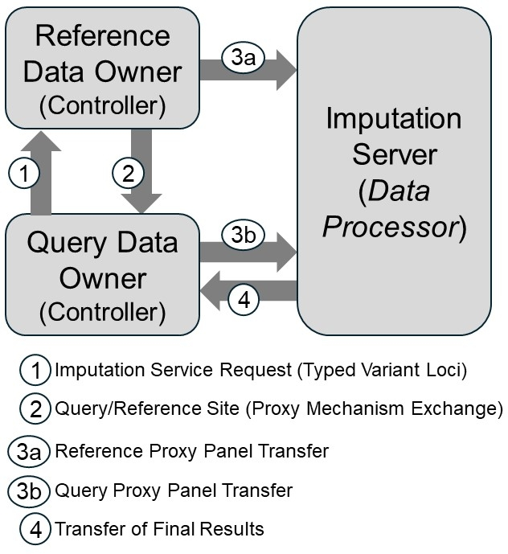

# ProxyTyper: Proxy-panel Generation for Outsourcing Genotype Imputation 

This repository contains the source code and related documentation for ProxyTyper, which is a tool for building privacy-preserving genotype imputation protocols. 

## Introduction

Genotype imputation is the process of filling the missing genotypes of one panel (*query panel*) by using another *more complete* panel, i.e., a reference panel. Genotype imputation is a fundamental step in many genetic analysis software and pipelines, e.g., genomewide association studies. Genotype imputation tools such as *BEAGLE* and *minimac4* use sparsely genotyped (i.e., *typed*) variants from, for example, genotyping arrays and impute variants that were untyped in the query panel.To achieve this, these tools use a reference panel that contains a large number of variants, overlap the typed variants in the client's panel, and impute the remaining variants that were untyped. Since reference panel contains very large number of subjects, these are generally not shareable due to privacy concerns. Also, genotype imputation is a computationally resource intensive process. To circumvent these issues, imputation servers can help: Users (i.e., querying sites) upload the typed variant panels to the servers, and servers impute the untyped variants and return results to the querying site. 

**There could be numerous privacy concerns here**, for instance query site sends the panel in clearly visible format. Also, the imputation server stores the reference panel clearly visible format. Returning the untyped variants to the query site without subject to any privacy policy can also lead to several privacy concerns.

**There is generally a 3rd party that is unacknowledged in imputation process**, which is the data owners of the reference panel. This is because the reference panels are generally collected from large sequencing efforts that are not directly related to the imputation servers, which are using the reference panel potentially as a 3rd party. Any risk and/or threat factor/model/actor should be communicated to and considered by the data owners. In summary, it is important to include data owners as an active entity in the outsourcing of genotype imputation. 

ProxyTyper aims to build a more complete data and risk assessment/management model by starting at the data owners' (or an authorized data manager's) site, where reference panel is converted to a "proxized" form by protecting variants and genotypes. Same applies to the query site, who, concurrently with data owner, generates a concordant proxized query panel. These panels are sent to the imputation server, who provides the computational infrastructure for genotype imputation.

## Why do we need another tool for genotype imputation?
ProxyTyper is not a genotype imputation tool. It relies on existing imputation software (by default BEAGLE). In a nutshell, ProxyTyper uses numerous "*proxizing mechanisms*" to protect typed and untyped variants in imputation. These include resampling panels, hashing alleles, augmenting variants, etc. These are described in detail on other parts of this repository. These mechanisms can be used to build pipelines that "map and mutate" an existing panel to a proxy-panel. The proxy-panels differ from their original counterparts with respect to many properties:
<ol>
<li> Number of variants: Mechanisms can expand the typed and untyped variants to arbitrarily increase number of variants.
<li> Variant coordinates: Mechanisms can anonymize the coordinates and genetic distances. 
<li> Number of subjects: Mechanisms can resample phased panels to arbitrary number of subjects to generate proxy subjects who has mosaic genomes of original subjects.
<li> Allele frequency spectrum of variants: Mechanisms can hash variant alleles in phased genomes and generate new proxy variants, whose alleles frequencies are very different from the variants in the vicinity.
</ol>
Although proxy-panels differ from their original counter parts, they still look and feel like valid genotype panels and can be input to imputation software such as BEAGLE. Furthermore, they can be used to perform genotype imputation by using protocols that have small number of interactions.

## Installation
Please follow the steps under */installation* to install and setup ProxyTyper.

## Where should I start?
After installing ProxyTyper, you can start reviewing the examples under */examples* directory. There are numerous examples and descriptions in these folders that should familiarize users with the mechanisms, scripting patterns, and building protocols with ProxyTyper.

Under */protocols* directory, there are several complete protocols that implement imputation. 

---

Please refer to the */examples* directory that runs the whole imputation protocol with the steps described in the manuscript.