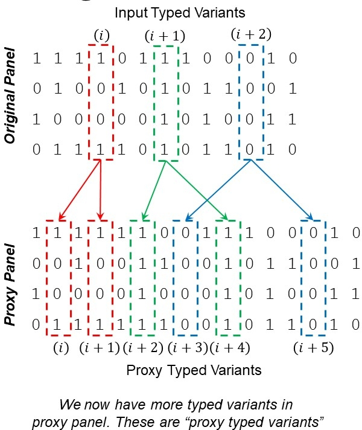
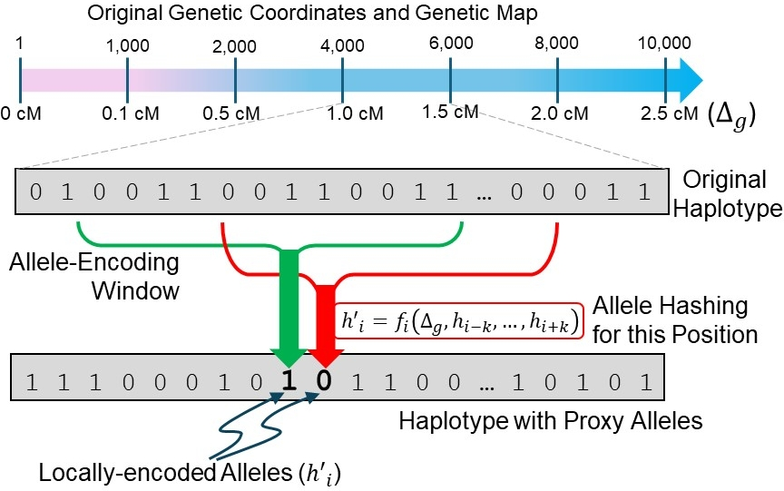
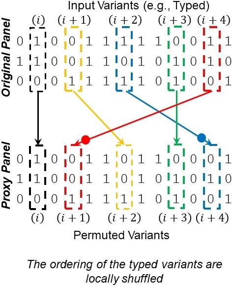

# Protecting Typed Variants using Model-based Mechanisms

This folder contains examples of the mechanisms for protecting typed variants in ProxyTyper's imputation pipelines.

## Why do you call these "Model-based" Mechanisms?
While outsourcing genotype imputation, typed variants' alleles must be concordantly proxized by the query and reference sites. Thus, query and reference sites must agree on a predefined set of rules to encode/anonymize the tag variant coordinates and alleles before sending them to the imputation server. These rules are specified in these "models", which are, for example, permutation of coordinates, and encoding weights for alleles in phased panels.

We therefore refer to these mechanisms as "model-based" mechanisms as they are based on a predefined set of rules, e.g., permute variants with a specific permutation pattern. These models are initialized using a procedure that introduces randomness to make sure that the proxized panels generated by the mechanisms cannot be inverted to original panels systematically. Obviously, these models must be treated as confidential information and should not be shared publicly.

The models generated by these mechanisms are stored under the proxization models directory that is specific in PROXYTYPER.ini file with the line:
```
MODELS_DIR=PROXIZATION_MODELS
```
Most of the models are extended BED files that describe permutations of coordinates, mapping of coordinates, and randomly selected biases to be added to the genotypes. As such, they can be viewed in simple text editors (Except for the hashing parameters, which are stored in binary format).

## Typed Variant Augmentation
Augmentation increases the number of typed variants by flipping a coin at each typed variant and selecting (or skipping it) to add it to the vicinity of the current typed variant. The position is selected by choosing a random location between current variant and previous variant ensuring that it does not overlap with any of the typed or untyped variants. 

<p align="center"></p>

Starting from a panel, it is first necessary to build the augmentation model:
```
./ProxyTyper.sh -generate_tag_augmenter_model TYPED_VARIANTS.bed ALL_VARIANTS.bed
```
here ProxyTyper generates a tag augmentation model using the coordinates of the whole set of variants. The augmentation model describes where each augmented variants should be inserted and which variant it is "paired" with in the original dataset. The model for augmentation is an extended BED file and is stored under models directory:
```
PROXIZATION_MODELS/tag_augmenter_model_1_original.bed   : The list of original variants in the panel 
PROXIZATION_MODELS/tag_augmenter_model_1_mapped.bed     : The list of augmented variants in the augmented panel
...
```
You may notice that there are multiple augmenting files under models directory. This is because ProxyTyper can perform augmentation recursively multiple times to arbitrarily expand the tag variant set. By default, we use 3 augmentations.

To augment a panel at query or reference site (not at imputation server, obviously), we run the following command:
```
PANEL_ID=vcf_import_panel
./ProxyTyper.sh -augment_tag_variants ${PANEL_ID} ${PANEL_ID}_tag_augmented
```
This command automatically augments the typed variants in the panel to correct positions defined by the augmentation model. The untyped variants (if there are any) are copied without any modifications. 

After this command finishes, you can see that there many variants in the augmented panel compared to the original panel:
```
wc -l ${PANEL_ID}_variants.bed
wc -l ${PANEL_ID}_tag_augmented_variants.bed
```

### Parameters that Govern Typed Variant Augmentation
In ProxyTyper's configuration file, following lines describe the augmentation model parameters:
```
n_tag_augments=3                    : # of recursive augmentations.
tag_augmenter_probability=0.99      : Probability of selecting a typed variant for augmentation.
tag_genotype_augmentation_type=1    : The type of genotype copying in augmentation: 0: Initialize to 0; 1: Copy the genotype from typed variants.
```

## Local Hash Encoding of Typed Variant Alleles
Given a phased (or randomly phased) panel, ProxyTyper protects the genotypes of each typed variant by locally hashing the alleles using the alleles around the variant. 

<p align="center"></p>

This is performed using a modular-2 combination of alelles:
```
hash(x_i) = ((\sum_j  \bias_j + w_j * x_j) + 
            (\sum_{jk} \bias_jk + w_jk * x_j * x_k) + 
            (\sum_{jkl} \bias_jkl + w_jkl * x_j * x_k * x_l)) mod 2
```
where j, k, l are variants in the vicinity of variant i. In summary, each allele is replaced by a modulo-2 combination of weighted sums of the alleles of variants in the vicinity after adding a bias for each component. In this hashing, the weights (w_j, w_jk, w_jkl) and biases (\bias_j, \bias_j, \bias_jkl) are selected in model building stage randomly with 50% probability. Note that since we do modulo-2 hashing, all weights and biases are binary values.

Given the typed variants, ProxyTyper generates the random hashing models at each typed variants using following:
```
./ProxyTyper.sh -generate_tag_proxizer_model TYPED_VARIANTS.bed 
```
This command selects the weights and biases for all typed variants. Note that in this selection, ProxyTyper gives more weight to variants that are closer using the genetic maps. After generating the hashing model, this model can be used at the query or reference site (not imputation server, obviously) to hash the alleles:
```
PANEL_ID=vcf_import_panel
./ProxyTyper.sh -proxize_tag_variants ${PANEL_ID} ${PANEL_ID}_proxy.hashing
```
If you calculate the alternate allele frequencies on the hashed alleles, you can see that the allele frequencies are very different from the original panel's allele frequencies (note that this is in the variant identifier.)
```
./ProxyTyper.sh -calculate_panel_AAF ${PANEL_ID}_proxy.hashing ${PANEL_ID}_proxy.hashing_AAF.bed
```

### Parameters that Govern Typed Variant Allele Hashing
Following parameters in PROXYTYPER.ini govern the hashing model selection:
```
filter_proxization_vicinity_size=5          : The largest left/right vicinty (number of typed variants) used in hashing, i.e., 5 means 11 variants are used.
var_weight=1                                : Keep this as is.
coding_modulus=2                            : We are doing modulo-2, don't change.
allele_err_eps=0.00                         : We do not add errors.
normalized_N_e=600                          : This is the N_e that we will use for variant selection. Given variant j that is d cMs apart from the variant i, we use it with probability 1-exp(-4*d*N_e)

var_weight_prob=0.3                         : Probability of selecting a first order weight, i.e., w_j
var2var_interaction_prob=0.8                : Probability of selecting a second order weight, i.e., w_jk
var2var2var_interaction_prob=0.6            : Probability of selecting a third order weight, i.e., w_jkl
filter_weight_inversion_prob=0.5            : The probability of biases. Keep this as 0.5, don't change it.
filter_proxization_min_n_params_per_var=2   : Hard cutoff on the number of minimum components for hashing each variant. We want at least 2 non-zero components for hashing each variant.
```

## Local Permutation of Typed Variants
Local permutation mechanism permutes variants to new locations. This is a very strong protection mechanism because it breaks the continuity of the variants from publicly available reference panels. For instance, if we augment variants then locally permute them, we will get a fairly convoluted version of the original set of variants, which are also expanded to a new size.

<p align="center"></p>

In a nutshell, permutation slides a window over the typed variants. At each window, it flips a coin and permutes all typed variants in the window if the coin tossed heads (this is a biased coin that we define in configuration file).

To build a local permutation model, we use following command:
```
./ProxyTyper.sh -generate_tag_permuter_model TYPED_VARIANTS.bed 
```
This option takes the typed variant positions (which is immediately available to the reference panel) and runs the sliding window to generate the permuted coordinates for the typed variants.

The typed variant permutation model is stored in one BED file under *PROXIZATION_MODELS/* directory.

The permutation model is then used to shuffle tha typed variants in an existing panel:
```
PANEL_ID=vcf_import_panel
./ProxyTyper.sh -permute_proxize_tag_variants ${PANEL_ID} ${PANEL_ID}_proxy.permute
```
In the course of permutation, the typed variants are shuffled and untyped variants (if there is any) are copid as they were. After permuting, the typed variant genotypes are randomly inverted by a bias term.

### Parameters that Govern Typed Variant Permutation
Following parameters in PROXYTYPER.ini govern the typed variant permutation:
```
perm_proxization_vicinity_size=2        : The left/right vicinity of the sliding permutation window length, e.g., +2/-2 indicates 5-variant permutation window.
perm_proxy_geno_inversion_prob=0.5      : The probability of adding a bias term the genotypes while after permutation. 
perm_proxy_perm_prob=0.1                : The probability of permuting typed variants at each sliding window.
```
This mechanism plays an important role in unphased imputation protocol that we present later. Up to 90% of typed variants in unphased protocol are shuffled within their vicinities.

# "You described all these mechanisms but who instantiates the models? There are 3 sites in imputation protocols..."
In principle, the protocols should start with query site sending the typed variant positions to the reference site (not the imputation server). After this, all models are initialized by the reference site (not the imputation server). The reference site shares the model files, i.e., zip and add password to PROXIZATION_MODELS directory and send it to the query site (not to imputation server). Query and reference sites locally apply the mechanisms to their datasets. Finally, the data are sent to the imputation server -- who does not receive any information about the models.

# If the models leak to the imputation server, can they easily decode the genotypes?
In the protocols we currently present, query site sends unphased proxized panels to the imputation server (regardless of whether they started with a phased panel). Thus, it is not immediately possible to decode query's panel to the original panel. 

However, the reference site sends the phased proxized panels to imputation server. If the imputation server has the proxization models, they can run a decoding hidden Markov model (HMM) that we described in our manuscript to very accurately decode the reference panel. After decoding, they would obtain a permuted/augmented version of the tag alleles. In addition since resampling is used, it would not immediately be possible to gain access to the chromosome-long haplotypes. This would, in principle, provide as much protection as the resampling-based protection methods.

---

Example demos of the augmentation, hashing, and permutation mechanisms described here are implemented in bash scripts named *Augmenting_Typed_Variants.sh*, *Hash_Encoding_Typed_Variants.sh*, and *Local_Permuting_Typed_Variants.sh*.