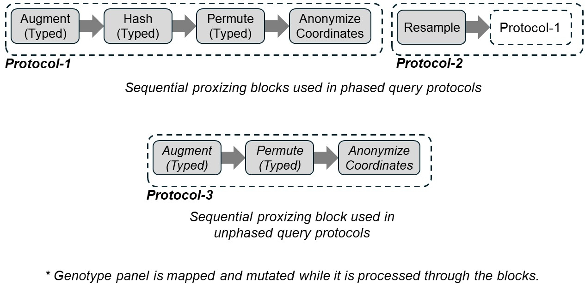
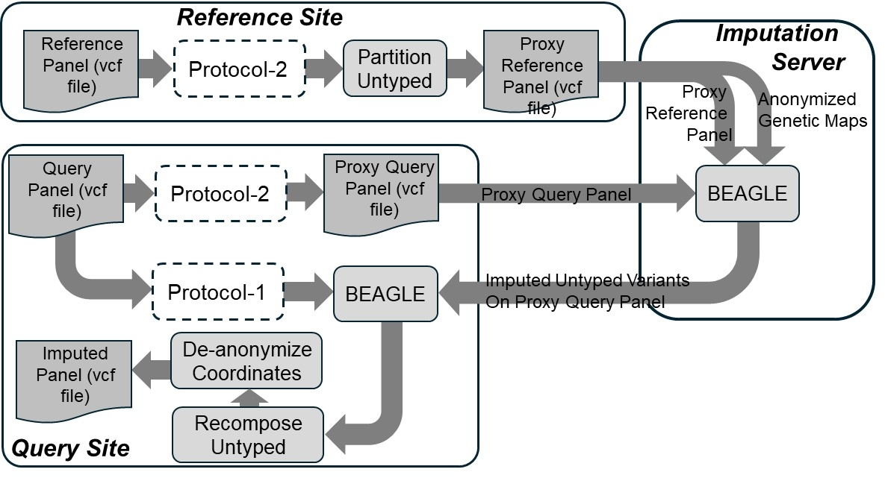
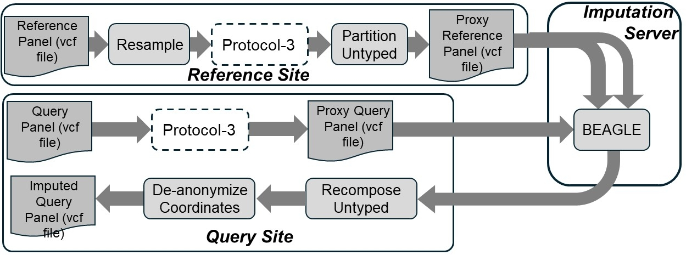

# Putting it all Together: Example Imputation Pipelines

In this folder, we include a phased and an unphased imputation protocol as two complete protocols. These protocols are implemented in *Phased_Hashing_Only_Protocol.sh* and *Unphased_Resampling_Only_Protocol.sh*. For simplicity, we separated data extraction step into another script named *Setup_Query_Ref_KG_data.sh*, which processes chromosome 20 from The 1000 Genomes Project.

## Requirements
Before running the pipelines, it is also necessary to install */usr/bin/time* command for saving time/memory usage of the steps of the protocol. This executable is not a part of ProxyTyper but it is useful to have for collecting resource usage. This executable is a part of the GNU *time* utility and can be installed using:
```
apt-get install time
```

## Designing new Imputation Protocols
We found that the easiest way to build new protocols is to use the panel proxizing mechanisms as a pipeline where each step maps and mutates the panel, and offering protection. For example, we show below 3 blocks are that are used to build the complete imputation protocols. 
<p align="center"></p>

Each block can be thought of as a new mechanism that is made up of sequentially connected mechanisms. Custom blocks can be built by appending mechanisms in sequential order. 

### It seems like all pipelines are sequentially structured, would it make sense to use parallel architectures to design protocols?
Parallel blocks would enable generating more complex panels and may offer accuracy improvements. But this requires a merging mechanism (layer?) to combine the outputs of the parallel blocks into merged proxy panels. This is a complex process that requires ensuring that the panels are compatible (with respec to statistical properties and syntax/semantics). Currently, ProxyTyper does not have mechanisms for merging panels and this is a plan for future updates. 

## Phased Query Pipeline
This pipeline uses only resampling, hashing, and coordinate anonymization mechanisms. Reference site uses untyped variant decomposition to protect untyped variants. The mechanisms that we previously reviewed are implemented in a sequential pipeline. 

Note that the complete phased query protocol uses the pipeline shown below. In this example, we modify this pipeline.
<p align="center"></p>

## Unphased Query Pipeline
Unphased pipelines are needed when the query site does not have access to phased genotypes. In this case, the query site cannot use allele hashing since there is no haplotype level information. ProxyTyper makes use of permutation mechanism more aggressively to permute typed variant positions. In addition, random biases are added to the typed variants. Reference site uses resampling and permutation mechanism (matching to the query site) to protect typed variants. The untyped variants are protected by the decomposition mechanism. Finally, both sites use coordinate anonymization.

This protocol can be supplemented with typed variant augmentation at the beginning for further protection.  

<p align="center"></p>

**REMARK:** Note that we have separated the configuration file for the phased protocol (*PHASED_PROXYTYPER.ini*) from the unphased protocol (*UNPHASED_PROXYTYPER.ini*). The difference in these protocols is in the allele hashing parameters. Also, in unphased protocol, the permutation window is larger and the higher permutation probability is used to introduce more typed variant permutations.

**REMARK:** Note that we provide 4 other full protocols under *protocols/* folder to be used as phased and unphased query imputation protocols.


